# Diagrama de Clases del Backend - Sistema de Reservas

```mermaid
classDiagram
    %% ======================================
    %% API GATEWAY
    %% ======================================
    class APIGateway {
        +routeRequest(path: string, method: string): Response
        +authenticate(token: string): boolean
        +rateLimit(ip: string): boolean
    }

    %% ======================================
    %% AUTH SERVICE
    %% ======================================
    class AuthController {
        -authService: AuthService
        +register(createUserDto): Promise~ApiResponse~
        +login(loginDto): Promise~ApiResponse~
        +getProfile(userId: string): Promise~ApiResponse~
        +logout(userId: string): Promise~ApiResponse~
        +refreshToken(refreshTokenDto): Promise~ApiResponse~
        +forgotPassword(forgotPasswordDto): Promise~ApiResponse~
        +resetPassword(resetPasswordDto): Promise~ApiResponse~
        +verifyEmail(verifyEmailDto): Promise~ApiResponse~
        +validateToken(token: string): Promise~ApiResponse~
    }

    class AuthService {
        -userRepository: Repository~User~
        -jwtService: JwtService
        +register(createUserDto): Promise~UserResponse~
        +login(user: User): Promise~LoginResponse~
        +validateUser(email: string, password: string): Promise~User~
        +getProfile(userId: string): Promise~UserResponseDto~
        +generateToken(user: User): Promise~string~
        +refreshToken(refreshTokenDto): Promise~TokenResponse~
        +forgotPassword(forgotPasswordDto): Promise~MessageResponse~
        +resetPassword(resetPasswordDto): Promise~MessageResponse~
        +verifyEmail(verifyEmailDto): Promise~MessageResponse~
    }

    %% ======================================
    %% HOTEL SERVICE (includes rooms)
    %% ======================================
    class HotelsController {
        -hotelsService: HotelsService
        +create(createHotelDto, userId: string): Promise~ApiResponse~
        +findAll(): Promise~ApiResponse~
        +search(query: string): Promise~ApiResponse~
        +findOne(id: string): Promise~ApiResponse~
        +update(id: string, updateDto, userId: string): Promise~ApiResponse~
        +remove(id: string, userId: string): Promise~ApiResponse~
        +getHotelRooms(hotelId: string): Promise~ApiResponse~
        +getHotelReservations(hotelId: string): Promise~ApiResponse~
        +getHotelStatistics(hotelId: string): Promise~ApiResponse~
    }

    class HotelsService {
        -hotelRepository: Repository~Hotel~
        -roomRepository: Repository~Room~
        +create(createHotelDto, ownerId: string): Promise~HotelResponseDto~
        +findAll(): Promise~HotelResponseDto[]~
        +search(query: string): Promise~HotelResponseDto[]~
        +findOne(id: string): Promise~HotelResponseDto~
        +update(id: string, updateDto, userId: string): Promise~HotelResponseDto~
        +remove(id: string, userId: string): Promise~void~
        +createRoom(hotelId: string, createRoomDto): Promise~RoomResponseDto~
        +getHotelRooms(hotelId: string): Promise~RoomResponseDto[]~
        +updateRoom(roomId: string, updateDto): Promise~RoomResponseDto~
        +deleteRoom(roomId: string): Promise~void~
        +checkRoomAvailability(roomId: string, dates): Promise~boolean~
    }

    %% ======================================
    %% RESERVATION SERVICE
    %% ======================================
    class ReservationController {
        -reservationService: ReservationService
        +create(createReservationDto): Promise~ApiResponse~
        +findAll(): Promise~ApiResponse~
        +findOne(id: string): Promise~ApiResponse~
        +updateStatus(id: string, statusDto): Promise~ApiResponse~
        +cancel(id: string, cancelDto): Promise~ApiResponse~
        +getUserReservations(userId: string): Promise~ApiResponse~
        +confirmReservation(id: string): Promise~ApiResponse~
    }

    class ReservationService {
        -reservationRepository: Repository~Reservation~
        +create(createReservationDto, userId: string): Promise~ReservationResponseDto~
        +findAll(): Promise~ReservationResponseDto[]~
        +findOne(id: string): Promise~ReservationResponseDto~
        +updateStatus(id: string, status, userId: string): Promise~ReservationResponseDto~
        +cancel(id: string, reason: string, userId: string): Promise~ReservationResponseDto~
        +getUserReservations(userId: string): Promise~ReservationResponseDto[]~
        +confirmReservation(id: string): Promise~ReservationResponseDto~
    }

    %% ======================================
    %% PAYMENT SERVICE
    %% ======================================
    class PaymentController {
        -paymentService: PaymentService
        +createPayment(createPaymentDto): Promise~ApiResponse~
        +processPayment(processPaymentDto): Promise~ApiResponse~
        +getPaymentHistory(userId: string): Promise~ApiResponse~
        +refundPayment(id: string, refundDto): Promise~ApiResponse~
        +validateCard(cardDto): Promise~ApiResponse~
    }

    class PaymentService {
        +createPayment(createPaymentDto, userId: string): Promise~PaymentResponseDto~
        +processPayment(processPaymentDto, userId: string): Promise~PaymentResponseDto~
        +getPaymentHistory(userId: string): Promise~PaymentResponseDto[]~
        +refundPayment(id: string, refundDto): Promise~PaymentResponseDto~
        +validateCard(cardDto): Promise~boolean~
        +processCardPayment(paymentData): Promise~PaymentResult~
        +processPayPalPayment(paymentData): Promise~PaymentResult~
    }

    %% ======================================
    %% REVIEW SERVICE
    %% ======================================
    class ReviewController {
        -reviewService: ReviewService
        +create(createReviewDto): Promise~ApiResponse~
        +findAll(): Promise~ApiResponse~
        +getHotelReviews(hotelId: string): Promise~ApiResponse~
        +getUserReviews(userId: string): Promise~ApiResponse~
        +getHotelStats(hotelId: string): Promise~ApiResponse~
        +update(id: string, updateDto): Promise~ApiResponse~
        +remove(id: string): Promise~ApiResponse~
    }

    class ReviewService {
        +create(createReviewDto, userId: string): Promise~ReviewResponseDto~
        +findAll(): Promise~ReviewResponseDto[]~
        +getHotelReviews(hotelId: string): Promise~ReviewResponseDto[]~
        +getUserReviews(userId: string): Promise~ReviewResponseDto[]~
        +getHotelStats(hotelId: string): Promise~HotelReviewStats~
        +update(id: string, updateDto): Promise~ReviewResponseDto~
        +remove(id: string): Promise~void~
    }

    %% ======================================
    %% USER SERVICE
    %% ======================================
    class UsersController {
        -usersService: UsersService
        +getProfile(userId: string): Promise~ApiResponse~
        +updateProfile(userId: string, updateDto): Promise~ApiResponse~
        +getAllUsers(): Promise~ApiResponse~
        +getUserById(id: string): Promise~ApiResponse~
        +updateUser(id: string, updateDto): Promise~ApiResponse~
        +deleteUser(id: string): Promise~ApiResponse~
    }

    class UsersService {
        -userRepository: Repository~User~
        +getProfile(userId: string): Promise~UserResponseDto~
        +updateProfile(userId: string, updateDto): Promise~UserResponseDto~
        +getAllUsers(): Promise~UserResponseDto[]~
        +getUserById(id: string): Promise~UserResponseDto~
        +updateUser(id: string, updateDto): Promise~UserResponseDto~
        +deleteUser(id: string): Promise~void~
    }

    %% ======================================
    %% NOTIFICATION SERVICE
    %% ======================================
    class NotificationController {
        -notificationService: NotificationService
        +sendEmail(emailDto): Promise~ApiResponse~
        +sendReservationConfirmation(confirmationDto): Promise~ApiResponse~
        +sendReservationCancellation(cancellationDto): Promise~ApiResponse~
        +sendEmailVerification(verificationDto): Promise~ApiResponse~
    }

    class NotificationService {
        +sendEmail(emailDto): Promise~NotificationResponse~
        +sendReservationConfirmation(confirmationDto): Promise~NotificationResponse~
        +sendReservationCancellation(cancellationDto): Promise~NotificationResponse~
        +sendEmailVerification(verificationDto): Promise~NotificationResponse~
    }

    %% ======================================
    %% SEARCH SERVICE
    %% ======================================
    class SearchController {
        -searchService: SearchService
        +searchHotels(searchDto): Promise~ApiResponse~
        +searchRooms(searchDto): Promise~ApiResponse~
        +getSearchSuggestions(query: string): Promise~ApiResponse~
        +getPopularDestinations(): Promise~ApiResponse~
    }

    class SearchService {
        +searchHotels(searchDto): Promise~HotelResponseDto[]~
        +searchRooms(searchDto): Promise~RoomResponseDto[]~
        +getSearchSuggestions(query: string): Promise~string[]~
        +getPopularDestinations(): Promise~string[]~
    }

    %% ======================================
    %% REPORT SERVICE
    %% ======================================
    class ReportController {
        -reportService: ReportService
        +generateSalesReport(reportDto): Promise~ApiResponse~
        +generateOccupancyReport(reportDto): Promise~ApiResponse~
        +generateRevenueReport(reportDto): Promise~ApiResponse~
        +downloadReport(id: string, format: string): Promise~ApiResponse~
    }

    class ReportService {
        +generateSalesReport(reportDto): Promise~ReportResponseDto~
        +generateOccupancyReport(reportDto): Promise~ReportResponseDto~
        +generateRevenueReport(reportDto): Promise~ReportResponseDto~
        +downloadReport(id: string, format: string): Promise~Buffer~
    }

    %% ======================================
    %% AVAILABILITY SERVICE
    %% ======================================
    class AvailabilityController {
        -availabilityService: AvailabilityService
        +checkAvailability(checkDto): Promise~ApiResponse~
        +updateAvailability(updateDto): Promise~ApiResponse~
        +getAvailabilityCalendar(roomId: string): Promise~ApiResponse~
    }

    class AvailabilityService {
        -availabilityRepository: Repository~Availability~
        +checkAvailability(checkDto): Promise~boolean~
        +updateAvailability(updateDto): Promise~AvailabilityResponseDto~
        +getAvailabilityCalendar(roomId: string): Promise~CalendarResponseDto~
    }

    %% ======================================
    %% RELATIONSHIPS
    %% ======================================
    
    %% API Gateway routes to all controllers
    APIGateway --> AuthController
    APIGateway --> HotelsController
    APIGateway --> ReservationController
    APIGateway --> PaymentController
    APIGateway --> ReviewController
    APIGateway --> UsersController
    APIGateway --> NotificationController
    APIGateway --> SearchController
    APIGateway --> ReportController
    APIGateway --> AvailabilityController

    %% Controller-Service relationships
    AuthController --> AuthService
    HotelsController --> HotelsService
    ReservationController --> ReservationService
    PaymentController --> PaymentService
    ReviewController --> ReviewService
    UsersController --> UsersService
    NotificationController --> NotificationService
    SearchController --> SearchService
    ReportController --> ReportService
    AvailabilityController --> AvailabilityService

    %% Inter-service communication
    AuthService --> NotificationService : sends verification emails
    ReservationService --> PaymentService : processes payments
    ReservationService --> NotificationService : sends confirmations
    PaymentService --> NotificationService : sends payment confirmations
    SearchService --> HotelsService : searches hotels
    ReportService --> ReservationService : gets reservation data
    ReportService --> PaymentService : gets payment data
    HotelsService --> AvailabilityService : checks room availability
```

## Descripción del Diagrama

Este diagrama muestra la arquitectura simplificada de clases del backend del sistema de reservas, enfocándose en los componentes principales y sus relaciones.

### **Arquitectura de Microservicios**

1. **API Gateway**: Punto de entrada único que enruta solicitudes a los microservicios
2. **Auth Service**: Autenticación, autorización y gestión de sesiones
3. **Hotel Service**: Gestiona hoteles y habitaciones (unificado)
4. **Reservation Service**: Maneja el ciclo de vida de las reservas
5. **Payment Service**: Procesamiento de pagos y reembolsos
6. **Review Service**: Sistema de reseñas y calificaciones
7. **User Service**: Administración de perfiles de usuario
8. **Notification Service**: Envío de emails y notificaciones
9. **Search Service**: Búsqueda de hoteles y habitaciones
10. **Report Service**: Generación de reportes y analytics
11. **Availability Service**: Gestión de disponibilidad de habitaciones

### **Patrones de Arquitectura**

- **Microservicios**: Cada servicio es independiente y especializado
- **Controller-Service Pattern**: Separación de responsabilidades
- **Repository Pattern**: Abstracción de acceso a datos
- **API Gateway Pattern**: Punto único de entrada

### **Comunicación Entre Servicios**

- **Auth → Notification**: Envío de emails de verificación
- **Reservation → Payment**: Procesamiento de pagos
- **Reservation → Notification**: Confirmaciones de reserva  
- **Payment → Notification**: Confirmaciones de pago
- **Search → Hotels**: Búsqueda de hoteles
- **Hotels → Availability**: Verificación de disponibilidad
- **Report → Múltiples servicios**: Recopilación de datos

### **Características del Sistema**

- **Autenticación JWT**: Tokens seguros para autenticación
- **Autorización por roles**: Control de acceso basado en roles
- **Validación automática**: DTOs con validaciones
- **Documentación API**: Swagger/OpenAPI
- **Manejo consistente de errores**: Respuestas estandarizadas