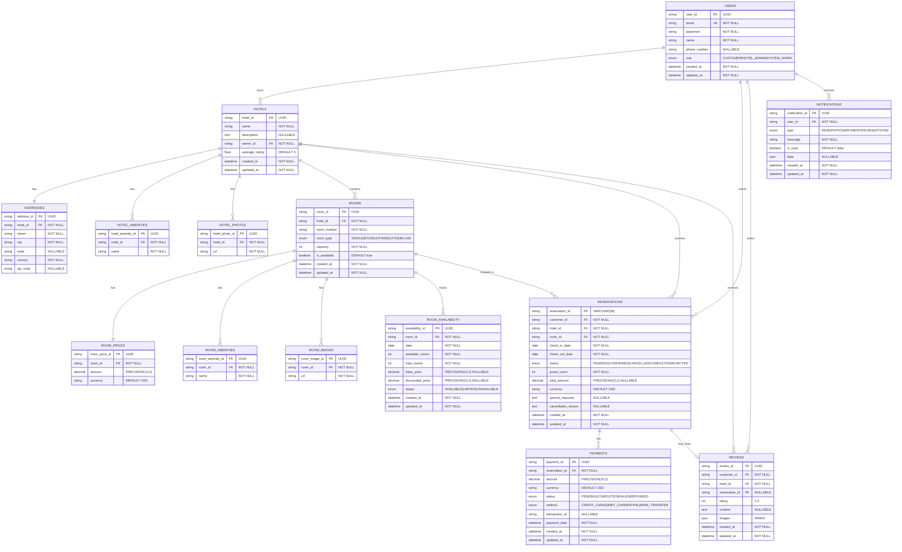

# Diagrama de Entidad-Relación del Sistema de Reservas

## Descripción del Diagrama

### Entidades Principales

1. **USERS**: Usuarios del sistema (clientes, administradores de hotel, administradores del sistema)
2. **HOTELS**: Hoteles registrados en el sistema
3. **ROOMS**: Habitaciones de cada hotel
4. **RESERVATIONS**: Reservas realizadas por los clientes
5. **PAYMENTS**: Pagos asociados a las reservas
6. **REVIEWS**: Reseñas escritas por los clientes
7. **NOTIFICATIONS**: Notificaciones enviadas a los usuarios

### Entidades de Soporte

1. **ADDRESSES**: Direcciones de los hoteles
2. **HOTEL_AMENITIES**: Amenidades de los hoteles
3. **HOTEL_PHOTOS**: Fotos de los hoteles
4. **ROOM_PRICES**: Precios de las habitaciones
5. **ROOM_AMENITIES**: Amenidades de las habitaciones
6. **ROOM_IMAGES**: Imágenes de las habitaciones
7. **ROOM_AVAILABILITY**: Disponibilidad de habitaciones por fecha

### Relaciones Principales

- **Un usuario** puede ser propietario de **múltiples hoteles**
- **Un hotel** tiene **una dirección**, **múltiples amenidades**, **múltiples fotos** y **múltiples habitaciones**
- **Una habitación** tiene **un precio**, **múltiples amenidades**, **múltiples imágenes** y **múltiple disponibilidad por fecha**
- **Un usuario** puede hacer **múltiples reservas**
- **Una reserva** puede tener **múltiples pagos** y **una reseña opcional**
- **Un usuario** puede escribir **múltiples reseñas** y recibir **múltiples notificaciones**

### Cardinalidades

- `||--||`: Relación uno a uno
- `||--o{`: Relación uno a muchos
- `||--o|`: Relación uno a uno opcional

### Tipos de Datos

- **UUID**: Identificadores únicos universales
- **VARCHAR**: Cadenas de texto con longitud específica
- **TEXT**: Texto largo
- **DECIMAL**: Números decimales con precisión específica
- **INT**: Números enteros
- **BOOLEAN**: Valores verdadero/falso
- **DATE**: Fechas
- **DATETIME**: Fecha y hora
- **ENUM**: Valores enumerados
- **JSON**: Datos en formato JSON

### Índices y Constraints

- **PK**: Clave primaria
- **FK**: Clave foránea
- **UK**: Clave única
- **INDEX**: Índice para optimizar consultas (especialmente en ROOM_AVAILABILITY)